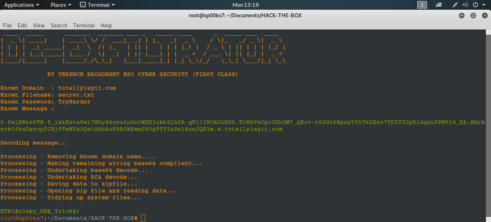

# RC4-CRACKER
Python script file to crack RS4 encrypted DNS exfiltration file captured via Wireshark.

| LANGUAGE | FILENAME | MD5 Hash |
|------    |------    | -------  |
| python | rsa-cracker.py | MD5 Hash - x |

- [ ] Requires 3rd party [RC4](https://pypi.org/project/arc4/) to be installed.

 

A python script file that cracks RC4 encrypted DNS exfiltration file from known variables extracted from Wireshark.

## CONSOLE DISPLAY

