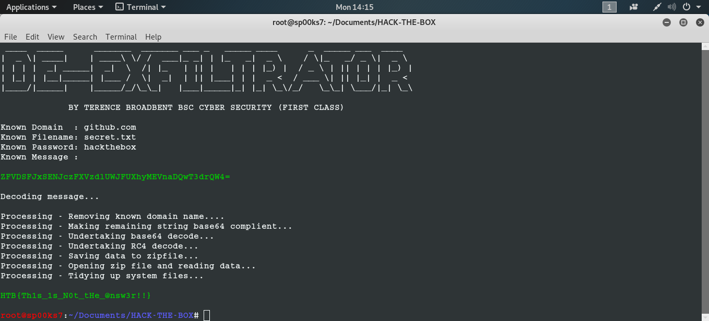

# DE-EXFILTRATOR
## A PYTHON SCRIPT FILE TO DECRYPT ENCRYPTED DNS EXFILTRATION FILES CAPTURED VIA WIRESHARK.

Usage: python De-Exfiltrator

| LANGUAGE | FILENAME          | MD5 Hash                                    |
|------    |------             | -------                                     |
| python   | De-Exfiltrator.py | MD5 Hash - 6537dac7c3f7dfb2d5a15b320047396f |

- [x] Requires 3rd party [RC4](https://pypi.org/project/arc4/) to be installed.
- [ ] See [DNSExfiltrator](https://github.com/Arno0x/DNSExfiltrator).

A python script file that decrypts RC4 encrypted DNS exfiltration files from known variables extracted via Wireshark.

### CONSOLE DISPLAY

